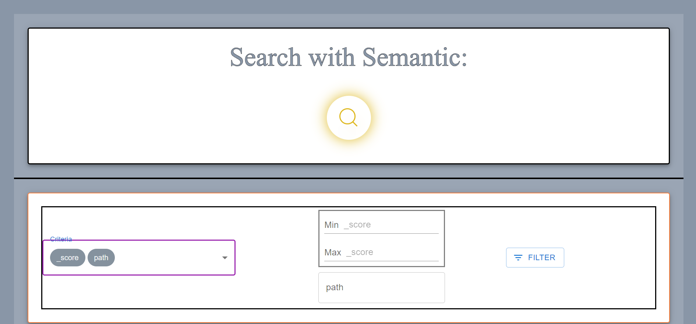
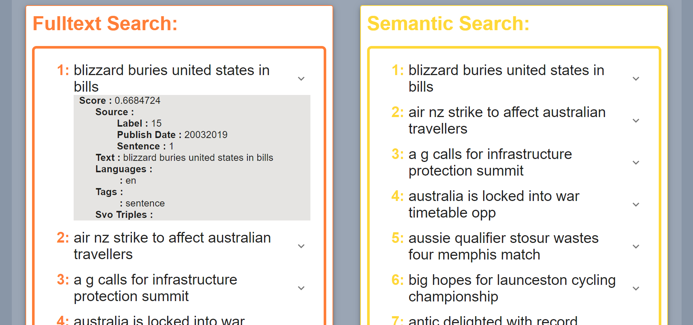

# oss

During my work as a research assistant at FZI, I was responsible, among other things, for the design and implementation of a front-end for a semantic search. The search solution was based on OpenSearch, and I developed the front-end using ReactJS. My work involved designing a user-friendly interface that enabled efficient and flexible search, as well as integrating the semantic search functions into the user interface.

